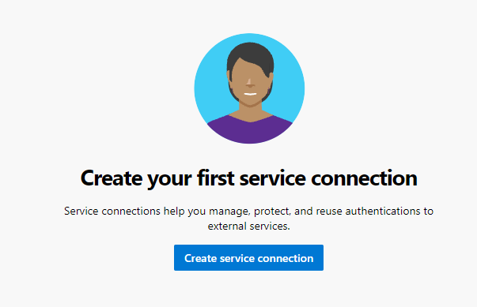
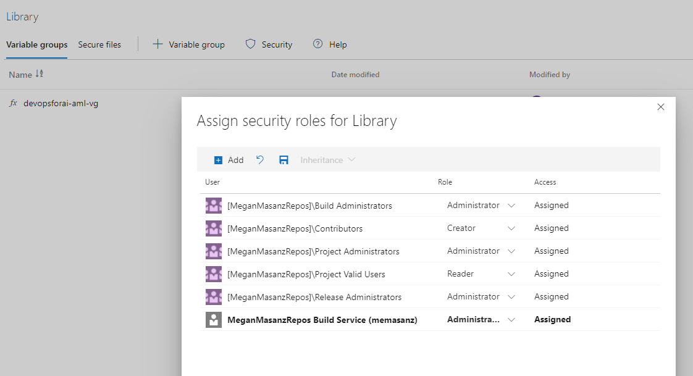

AMLHackathonWithMLOps
=====================

**Overview:**

MLOps can be considered to be confusing for non-devOps folks. This repo attempts
to automate that process for someone who is a user of AzureML environments.

This code is based off the repo: <https://github.com/microsoft/MLOpsPython>

It seeks to automate the process of setting up an MLOps Pipeline to reduce
manual configuration.

This Hackathon will walk through the process to creating an MLOps DevOps
repository programmatically. The only manual configuration that will be required
is that of the service connections connecting the AML workspaces to devOps.

From the Market place you can install the AML Service Connection

MLOps
-----

Current Thoughts: MLOps - https://www.youtube.com/watch?v=nst3UAGpiBA AML Model
artifact as trigger - registration of model triggers a pipeline. Once model is
registered, package model and deploy as service. Creating code drives generation
and deployments pipelines are reproducible and verifiable artifacts are
tagged/audited

Requirements:

3 Azure ML workspaces (dev, qa, prod)

Ability to create an Azure ML Service Connection.

TO DO:

Provide instructions

Create an Azure ML Service Connection

Inside devOps – let’s create a service connection.

Text Description automatically generated

A picture containing Teams Description automatically generated

There should be 3 Service Connections. 1 for dev, one for qa, and one for prod.

We will be creating variable groups as part of the devOps pipeline
configuration. You will need to add the Build service as a library
administrator.

We will leverage a compute instance in the AML Workspace to generate yml files
to:

1.  Create the variable groups for our DevOps pipeline to leverage. This will
    allow us to move code from one workspace to another workspace.

Once the yml is updated from the 3 environments, we can run the
Azure-Dev-Ops-Configuration pipline. This pipeline will:

1.  Install the DevOps CLI

2.  Create the variable groups leveraged by our devOps Pipelines

3.  Setup the devOps pipeline for Model training.
